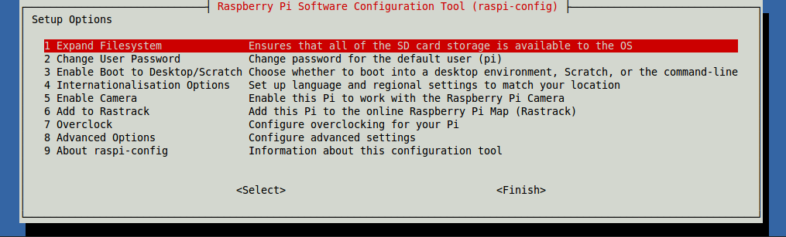

# raspi-config

`raspi-config` 是树莓派的配置工具，它的编写和维护由 [Alex Bradbury](https://github.com/asb). 它工作在Raspbian.

<a name="usage"></a>
## 用法

第一次启动Raspbian时会显示`raspi-config`n. 这之后需要打开配置工具只要在命令行输入以下命令：

```
sudo raspi-config
```

因为用户`pi`自己不能改变文件，所以必须加上`sudo`前缀

你可以看到一个蓝色屏幕中间灰色方框中的选项，如图:



它包含了以下可选项：

```
                        Raspberry Pi Software Configuration Tool (raspi-config)

Setup Options

    1 Expand Filesystem              Ensures that all of the SD card storage is available to the OS
    2 Change User Password           Change password for the default user (pi)
    3 Enable Boot to Desktop/Scratch Choose whether to boot into a desktop environment, Scratch, or the command line
    4 Internationalisation Options   Set up language and regional settings to match your location
    5 Enable Camera                  Enable this Pi to work with the Raspberry Pi Camera
    6 Add to Rastrack                Add this Pi to the online Raspberry Pi Map (Rastrack)
    7 Overclock                      Configure overclocking for your Pi
    8 Advanced Options               Configure advanced settings
    9 About `raspi-config`           Information about this configuration tool

                                   <Select>                                  <Finish>
```

### 选择菜单，在菜单中移动

使用向上和向下箭头键移动高亮区域进行选择。按向右箭头键会跳出选择菜单，出现`<选择>`和`<完成>`按钮。按向左箭头键则返回选项菜单。另外，使用`Tab`键也可以上述状态的切换。

注意，那里很长的列表选项（就像城市时区列表），你能只输入一个单词通过字母滚动方式来保存选择。如输入`L`将跳到Lisbon，到London仅仅间隔2个选项。

### raspi-config做什么

一般来说, `raspi-config`的功能旨在提供更改最常用的配置。 可能只是自动编辑`/boot/config.txt`和各种标准的Linux配置文件。一些选项需要重启才能生效。如果你改变了那些需要重启的设置，`raspi-congif`会在你点击`完成（Finish）`按钮之后弹出提示。

## 菜单选项

<a name="expand-filesystem"></a>
### 扩展文件系统（Expand filesystem）

如果使用NOOBS安装Raspbian的，文件系统已被自动安装，你可以忽略这一步。然而, 使用SD卡烧入的方式，那么卡上有一部分不被使用；这需要耗费3GB以上的剩余空间。这一选项将填充你的SD卡剩余空间，是的你有更多空间使用文件。 您需要重启树莓派使其生效。请注意，选择后立即执行，没有提醒。

<a name="change-user-password"></a>
### 修改用户密码（Change user password）

默认用户为`pi`密码为`raspberry`. 您可以修改它。可以参考[users](../linux/usage/users.md).

<a name="change-boot-to-desktop"></a>
### 开启桌面或者Scratch开机启动（Enable boot to desktop or Scratch）

您能改变Pi启动时做些什么。使用这一选项修改您的启动偏好，命令行、图形桌面或者Scratch。

### 国际化（Internationalisation options）

选择`Internationalisation Options`并点击`Enter`调出子菜单包含以下选项：

<a name="change-locale"></a>
#### 修改区域设置（Change locale）

选择一个区域, 例如`en_GB.UTF-8 UTF-8`.

<a name="change-timezone"></a>
#### 修改时区（Change timezone）

选择您所在的时区, 开始选择区域如`Europe`; 然后选择城市如`London`. 键入首字母快速调转；

<a name="change-keyboard-layout"></a>
#### 修改键盘布局（Change keyboard layout）

这个选项弹出另一个允许你选择键盘布局的菜单。将花费较长时间来显示读取到的所有键盘类型。修改通常立即生效，但需要重启。

<a name="enable-camera"></a>
### 开启相机（Enable camera）

为了使用树莓派相机模块，您必须在这里开启它。选择选项并设置为`Enable`. 这个需要至少128M的内存分配各GPU使用。

<a name="add-to-rastrack"></a>
### Add to Rastrack

Rastrack is a user-contributed Google Map to which Pi users in the community have added their location; it shows a heat map of where Pi users are known to be around the world. This was set up by young Pi enthusiast [Ryan Walmsley](http://ryanteck.uk/) in 2012. Rastrack is located at [rastrack.co.uk](http://rastrack.co.uk/).

You can use this option to add your location to the map.

<a name="overclock"></a>
### 超频（Overclock）

树莓派CPU是可以超频的. 默认频率为700MHz但可以设置到1000MHz. 超频后将会有所不同; 超频过高可能导致不稳定性。选择此选项会显示下面的警告：

```
Be aware that overclocking may reduce the lifetime of your Raspberry Pi. If overclocking at a certain level causes system instability, try a more modest overclock. Hold down `shift` during boot to temporarily disable overclock.
```

### 高级选项（Advanced options）

<a name="overscan"></a>
#### Overscan

Old TV sets had a significant variation in the size of the picture they produced; some had cabinets that overlapped the screen. TV pictures were therefore given a black border so that none of the picture was lost; this is called overscan. Modern TVs and monitors don't need the border, and the signal doesn't allow for it. If the initial text shown on the screen disappears off the edge, you need to enable overscan to bring the border back.

Any changes will take effect after a reboot. You can have greater control over the settings by editing [config.txt](config-txt.md).

On some displays, particularly monitors, disabling overscan will make the picture fill the whole screen and correct the resolution. For other displays, it may be necessary to leave overscan enabled and adjust its values.

<a name="hostname"></a>
#### 主机名（Hostname）

为Pi设置一个可见的名称应用于网路上。

<a name="memory-split"></a>
#### 内存划分（Memory split）

改变内存量给GPU使用。

<a name="ssh"></a>
#### 安全外壳协议（SSH）

开启/关闭，通过SSH远程命令行访问Pi。

SSH allows you to remotely access the command line of the Raspberry Pi from another computer. Disabling this ensures the SSH service does not start on boot, freeing up processing resources. Read more about using [SSH](../remote-access/ssh/README.md). Note that SSH is enabled by default. If connecting your Pi directly to a public network, you should disable SSH unless you have set up secure passwords for all users.

<a name="spi"></a>
#### 串行外设接口（SPI）

Enable/disable automatic loading of SPI kernel module, needed for products such as PiFace.

<a name="audio"></a>
#### 音频（Audio）

Force audio out through HDMI or a 3.5mm jack. Read more about [audio configuration](audio-config.md).

<a name="update"></a>
#### 更新（Update）

Update this tool to the latest version.

<a name="about"></a>
### 关于（About raspi-config）

Selecting this option shows the following text:

```
This tool provides a straight-forward way of doing initial configuration of the Raspberry Pi. Although it can be run at any time, some of the options may have difficulties if you have heavily customised your installation.
```

<a name="finish"></a>
### 完成（Finish）

Use this button when you have completed your changes. You will be asked whether you want to reboot or not. When used for the first time it's best to reboot. There will be a delay in rebooting if you have chosen to resize your SD card.

## Development of this tool

See this tool's source at [github.com/asb/raspi-config](https://github.com/asb/raspi-config), where you can open issues and create pull requests.

---

*此文件内容源于eLinux wiki页 [RPi raspi-config](http://elinux.org/RPi_raspi-config), 分享基于 [Creative Commons Attribution-ShareAlike 3.0 Unported license](http://creativecommons.org/licenses/by-sa/3.0/)*

