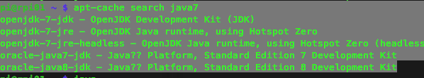
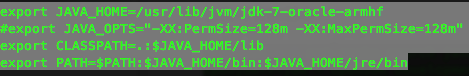

# 树莓派上安装JDK
- 以下安装环境基于Raspbian OS，如何安装请参考[安装](documentation/installation/README.md)

- 查询可安装版本<br>
	```
	apt-cache search java7
	```
	<br>


- 安装java7<br>
	```
	sudo apt-get install oracle-java7-jdk
	```
- 设置环境变量<br>
	```
	sudo vi /etc/profile
	```
	(个人习惯设置，全局或者当前用户--.barhrc)<br>
	<br>
	```
	export JAVA_HOME=/usr/lib/jvm/jdk-7-oracle-armhf
	export CLASSPATH=.:$JAVA_HOME/lib
	export PATH=$PATH:$JAVA_HOME/bin:$JAVA_HOME/jre/bin
	```
- 激活并查看<br>
	```
	source /etc/profile
	```
- Good Luck！
	