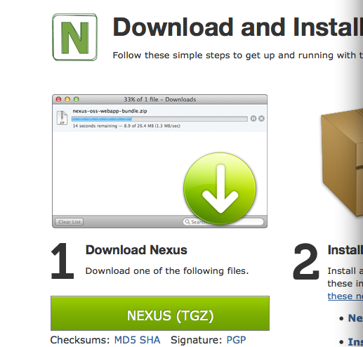
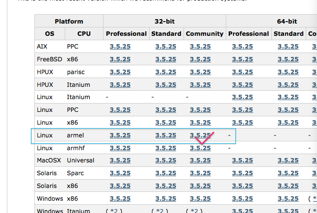
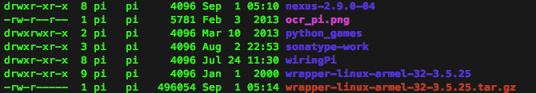
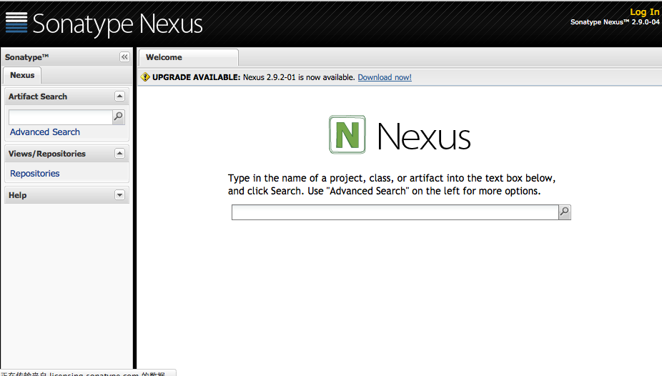
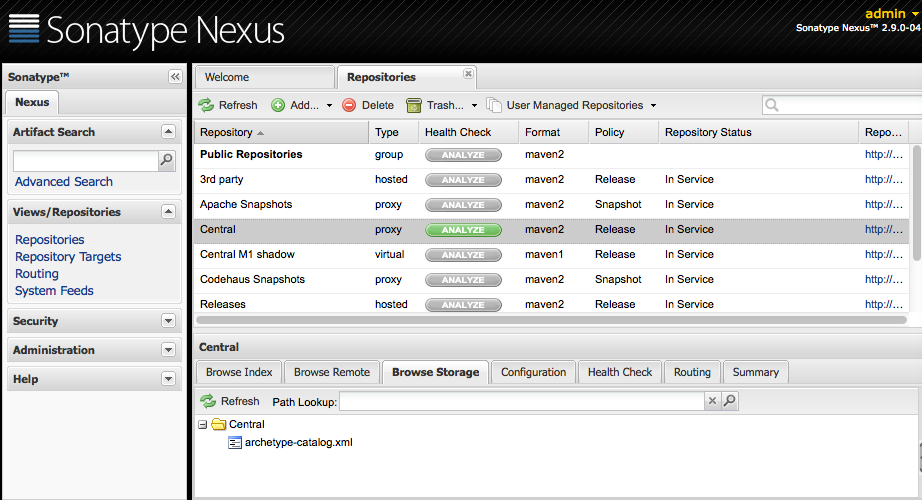

# Require
1. [Sonatype Nexus](http://www.sonatype.org/nexus/go),下载后最为.tgz文件, 而不是war包。
   <br>
   
2. [Wrapper](http://wrapper.tanukisoftware.com/doc/english/download.jsp), 使用版本学习用的，其他的你懂得。
   <br>
# Install
1. 上传文件到树莓派<br>
```
 $ scp [path by nexus_filename|wrapper_filename] username@host:path
```

2. 解压文件到工作目录下
	<br>

3. 运行
```
 $ cd nexus-2.9.0-04/bin/jsw
```

4. 运行
```
 $ mkdir linux-armv6l-32
```

5. 拷贝wrapper-linux-armel-32-3.5.25/bin/wrapper 到linux-armv6l-32下

# Run
1. 运行(这个启动是需要很长时间的... 5分钟吧就)
```
 $ cd nexus-2.9.0-04/bin
 $ ./nexus start
```

2. 打开浏览器键入 host:8081/nexus
<br>
<br>
8081为默认的端口号，要修改端口号可进入$NEXUS_HOME\conf\打开nexus.properties文件，修改application-port属性值就可以了。
默认的用户名和密码：admin/admin123，登录后看到图所示：
<br>