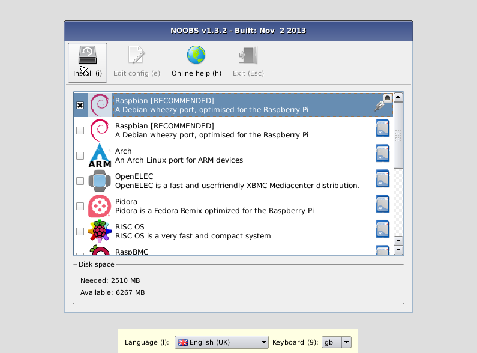

# NOOBS

**New Out Of the Box Software** - 树莓派的简易系统安装管理 

## 如何获得NOOBS

### 购买一块原先安装的SD卡

最简单的途径就是购买预装好NOOBS的SD卡，需要花费£4在 [swag store](http://swag.raspberrypi.org/collections/frontpage/products/noobs-8gb-sd-card).

### 下载（个人推荐）

另外，NOOBS可用版可以从树莓派网址上下载：[raspberrypi.org/downloads](http://www.raspberrypi.org/downloads)

#### 如何安装NOOBS到SD卡

一旦你已经下载了NOOBS zip文件，可以通过你的电脑将内容复制到已经格式化好的SD卡上。

为空SD卡安装NOOBS

- 以FAT方式格式化至少4GB的SD卡。怎样做请参照下面的说明。
- 下载并解压文件NOOBS。
- 解压并拷贝到SD卡的更目录下。请请注意，在某些情况下将文件可能提取到一个文件夹；如果是这样的话，请从文件夹内复制整个文件，而不是文件夹本身。
- 第一次启动“RECOVERY”项，将自动调整FAT分区的大小，并将可安装的系统列表显示出来。

#### 如何以FAT文件格式来格式化SD卡

##### Windows
Windows用户我们推荐使用“SD Association's Formatting Tool”来格式化SD卡，可以从这里下载到[sdcard.org](https://www.sdcard.org/downloads/formatter_4/)。
您需要选择菜单“选项（Options）”，将设置项“FORMAT SIZE ADJUSTMENT”设为“ON”状态来格式化整个SD卡卷，而非一个单独的分区。

##### Mac OS
Mac用户同样可以使用改工具[SD Association's Formatting Tool](https://www.sdcard.org/downloads/formatter_4/), 尽管系统默认的磁盘工具也可以格式化整个磁盘。 为此请选择“擦除”并以“MS-DOS”方式格式化。

##### Linux
Linux用户推荐使用“gparted”（命令行版本“parted”）. Norman Dunbar 曾写有 [instructions](http://qdosmsq.dunbar-it.co.uk/blog/2013/06/noobs-for-raspberry-pi/)。

## NOOBS包含什么？

NOOBS包含以下操作系统:

- [Raspbian](http://raspbian.org/)
- [Pidora](http://pidora.ca/)
- [OpenELEC](http://wiki.openelec.tv/index.php?title=Raspberry_Pi_FAQ)
- [RaspBMC](http://www.raspbmc.com/)
- [RISC OS](https://www.riscosopen.org/wiki/documentation/show/Welcome%20to%20RISC%20OS%20Pi)
- [Arch Linux](http://archlinuxarm.org/platforms/armv6/raspberry-pi)

自NOOBS v1.3.10 (September 2014)起, 仅有Raspbian作为NOOBS的默认安装。 其他安装都需要网络连接。

## NOOBS and NOOBS Lite

NOOBS的两种安装形式: 离线和网络安装；或者仅仅网络安装。

完整的版本还有每个操作系统的镜像文件，他们都可以独立离线安装到SD卡上，然而NOOBS Lite需要网络连接来下载被选择的操作系统。

注意：完整的版本中的操作系统镜像版本号过时的，如果连接到互联网后如果有更新的，会显示最新版本的操作系统。

## NOOBS开发

### NOOBS最新稳定版

最新稳定版为 **v1.3.10**, 发布于 **12日 9月 2014**.

### NOOBS文档

NOOBS包含更多配置，更综合的文档，可以在这找到[GitHub](https://github.com/raspberrypi/noobs/blob/master/README.md).

### NOOBS源码

NOOBS源码，可在这里找到 [GitHub](https://github.com/raspberrypi/noobs).
